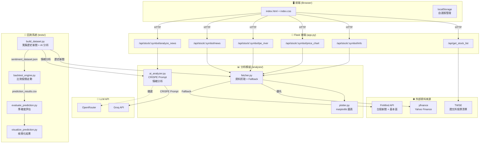

# 商管程式設計期末專案 - 股票基本面分析

這是一個以 Python 實作的台股基本面分析工具。
透過網頁介面管理自選股、查看歷史股價走勢、本益比河流圖，以及讀取真實財經新聞與基本面資料。

## 主要功能

- 自選股管理：新增、移除並儲存於瀏覽器 (localStorage)，無需登入即可使用。
- 基本面資訊：顯示目前股價、本益比 P/E、每股盈餘 EPS、ROE。
- 圖表分析：產生歷史股價走勢圖與本益比河流圖。
- 相關新聞與 AI 情緒分析：整合 yfinance 與 FinMind 新聞，自動抓取內文，並串接 LLM (OpenRouter/Groq) 進行量化情緒評分與生成個股分析報告。
- 回測系統：自動蒐集歷史新聞，透過 LLM 分析情緒並與實際股價走勢比對，評估預測準確度。
- 穩定 fallback：當 yfinance 因 SSL、網路或資料缺漏失敗時，改用 FinMind 或備援圖表，避免前端 500/404。

## 系統架構



## 資料來源與穩定性更新

本專案已將原本容易失敗或模擬的資料流程改為真實資料來源：

- 新聞資料與 AI 分析：
  - 優先讀取 yfinance 內建 Yahoo Finance 新聞。
  - 同時整合 FinMind `TaiwanStockNews`。
  - 會自動抓取新聞內文摘要提供給 AI 進行進階分析。
  - 回傳資料會正規化成前端固定格式：`title`、`source`、`date`、`url`。
  - AI 分析報告持久化儲存於 `static/reports/`，包含情緒分數、摘要與執行耗時資訊。
  - 若 yfinance 因本機 SSL 憑證問題失敗，會自動 fallback 到 FinMind，不讓新聞 API 中斷。

- 股價資料：
  - 優先使用 yfinance 歷史股價。
  - 若 yfinance 回傳空資料或發生錯誤，改用 FinMind `TaiwanStockPrice`。
  - 圖表 API 即使暫時無法取得資料，也會回傳 placeholder 圖表，不再讓前端收到 404。

- 基本面數據：
  - 本益比 P/E 取 FinMind `TaiwanStockPER` 最近一筆 `PER`。
  - 每股盈餘 EPS 取 FinMind `TaiwanStockFinancialStatements` 最近一期 `EPS`。
  - ROE 以最近四期 `IncomeAfterTaxes` 加總除以最新權益計算，回傳 decimal，前端顯示為百分比。
  - 若 yfinance fundamentals 無法使用，P/E、EPS、ROE 仍可由 FinMind 補值。

- 快取與產物：
  - yfinance cache 改放在專案內 `.yfinance_cache/`。
  - `.yfinance_cache/` 與測試快取不進 Git。
  - `static/images/` 內的圖表是執行時產物，若只是本機測試重新產生，不需要納入 commit。

## 專案結構

```
business_final_project/
├── analysis/               # 核心功能模組
│   ├── ai_analyzer.py      # LLM 新聞情緒分析 (CRISPE Prompt)
│   ├── fetcher.py          # yfinance + FinMind 資料抓取、fallback 與資料正規化
│   └── plotter.py          # matplotlib 圖表與 placeholder 圖表產生
├── docs/
│   └── SKILL.md            # 前端設計規範參考 (Neumorphism Design System)
├── imgs/                   # Demo 截圖
├── static/
│   ├── index.css           # 前端樣式 (Neumorphism 風格)
│   ├── images/             # 動態產生的圖表暫存
│   └── reports/            # AI 產生的新聞情緒分析報告
├── templates/
│   └── index.html          # 網頁前端模板
├── tests/                  # 回測系統與回歸測試
│   ├── build_dataset.py    # 自動蒐集歷史新聞 + AI 情緒分析 → sentiment_dataset.json
│   ├── backtest_engine.py  # 比對 AI 情緒與實際股價走勢，計算準確率
│   ├── evaluate_prediction.py  # 回測結果評估與報告
│   ├── visualize_prediction.py # 回測結果視覺化圖表
│   ├── utils.py            # 回測共用工具（Wilson CI、方向映射、色彩等）
│   ├── test_fetcher_news.py    # 新聞功能回歸測試
│   └── test_resilient_market_data.py  # 股價/基本面 fallback 測試
├── .env.example            # API 環境變數範例
├── .gitignore              # Git 忽略設定
├── app.py                  # Flask 後端伺服器
├── config.py               # API 與模型相關設定
├── portfolio.json          # 預設自選股清單（回測使用）
└── requirements.txt        # 專案套件需求
```

## 開發環境設置

本專案使用 Python 的虛擬環境 (venv) 進行開發，以確保套件版本獨立。

1. **建立虛擬環境**（若尚未建立）
   - Linux/macOS: `python3 -m venv .venv`
   - Windows: `python -m venv .venv`

2. **啟動虛擬環境**
   - Linux/macOS: `source .venv/bin/activate`
   - Windows: `.\.venv\Scripts\activate`

3. **安裝所需套件**
   ```bash
   pip install -r requirements.txt
   ```

4. **設定環境變數 (.env)**
   專案使用 `.env` 來管理 LLM 模型的 API 設定。請複製範例設定檔，並填入您的 API 金鑰與設定：
     ```bash
     cp .env.example .env
     ```
   
   複製後，打開 `.env` 進行編輯：
   - `OPENAI_API_KEY`: 填入您的 OpenAI API 金鑰或 OpenRouter API 金鑰等。
   - `OPENAI_API_BASE`: 若使用 OpenRouter，請填寫 `https://openrouter.ai/api/v1`；若為官方 OpenAI，請填寫 `https://api.openai.com/v1`。
   - `LLM_MODEL`: 您要呼叫的模型名稱。例如 `gpt-4o-mini`，或 OpenRouter 上的免費模型如 `nvidia/nemotron-3-super-120b-a12b:free`。

## 執行程式

啟動 Flask 網頁伺服器：
- Linux/macOS: `python3 app.py`
- Windows: `python app.py`

開啟後在瀏覽器中訪問：**[http://localhost:2330](http://localhost:2330)**

## 測試

### 回歸測試

執行所有回歸測試：

```bash
python -m unittest discover -s tests
```

目前測試覆蓋：

- yfinance 新聞格式正規化。
- yfinance 與 FinMind 新聞合併、去重。
- FinMind 新聞單日查詢格式。
- yfinance 股價失敗時改用 FinMind 股價。
- yfinance 基本面失敗時改用 FinMind P/E、EPS、ROE。
- 圖表與 API 在資料來源失敗時仍回 200，不回 500/404。

### AI 情緒預測回測系統

回測系統用於評估 AI 新聞情緒分析的預測準確度。

**Step 1: 建立資料集**（蒐集歷史新聞 + AI 情緒分析）
```bash
# 使用 portfolio.json 中的所有股票
python tests/build_dataset.py --start-date 2025-10-01 --end-date 2025-12-31

# 只分析特定股票
python tests/build_dataset.py --symbols 2330.TW 2454.TW --start-date 2025-10-01 --end-date 2025-12-31
```

**Step 2: 執行回測**（比對 AI 情緒 vs. 實際股價走勢）
```bash
python tests/evaluate_prediction.py
```

**Step 3: 視覺化結果**
```bash
python tests/visualize_prediction.py
```

回測結果將輸出至 `tests/results/` 資料夾：
- `prediction_results.csv` — 每則新聞的預測與實際方向
- `prediction_metrics.json` — 各時間跨度 (1/3/5/10/20/60天) 的準確率、F1 等指標
- `stock_metrics.csv` — 各股票的個別表現
- `classification_report.txt` — sklearn 分類報告

## Demo


